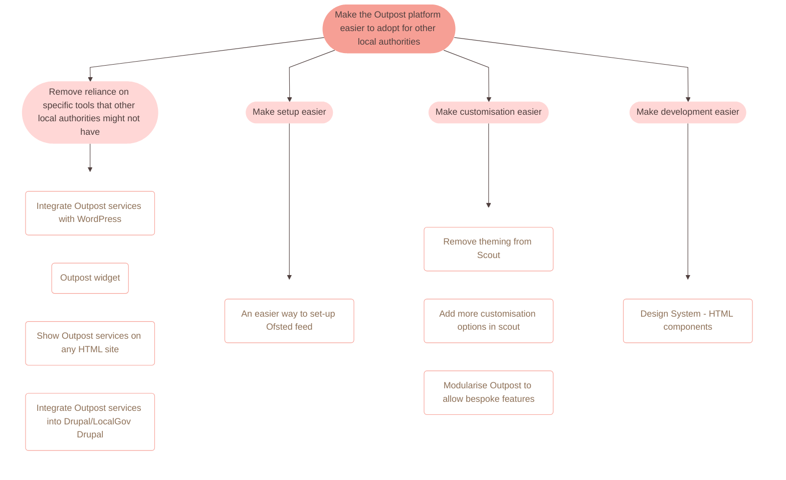
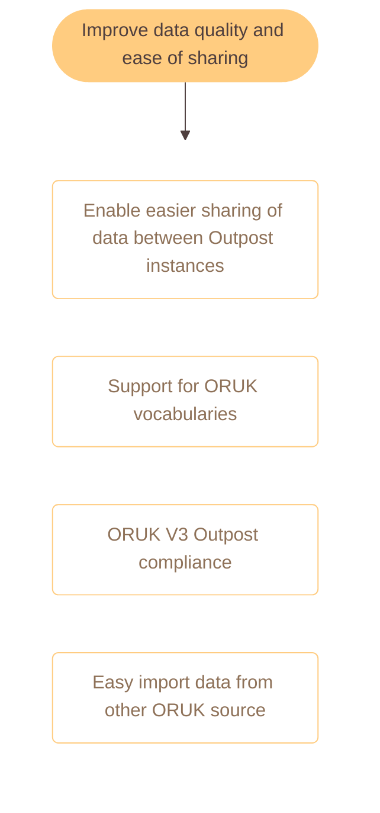
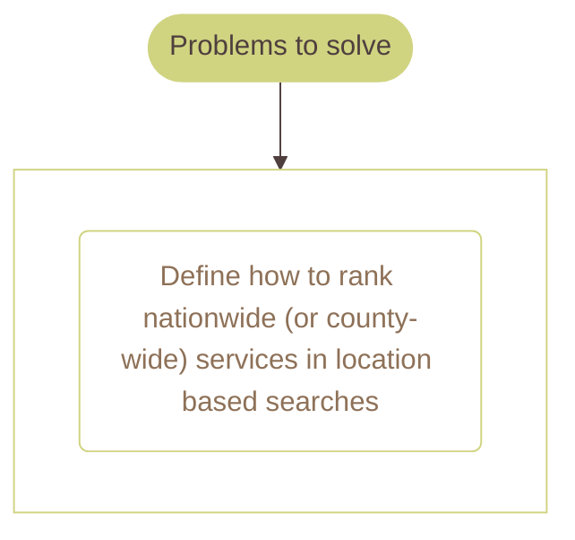

🔥 NB This README is auto generated! 🔥

# Make the Outpost platform easier to adopt for other local authorities

# Improve data quality and ease of sharing

# Improvements to Scout

# Make Outpost a better, easier to use product

# Problems to solve

